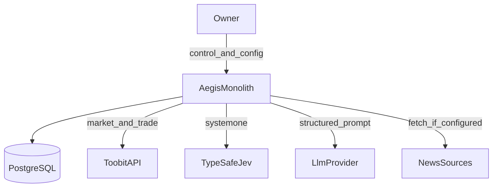
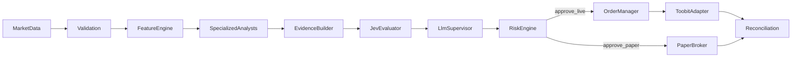
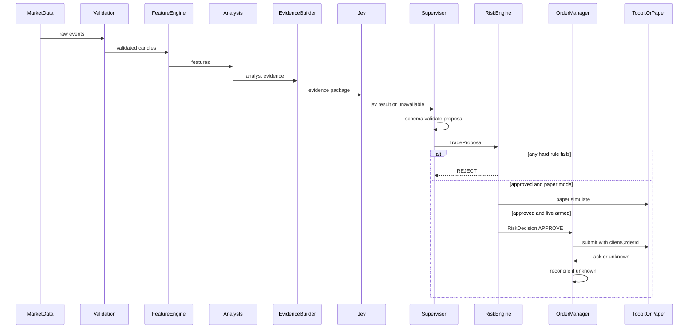
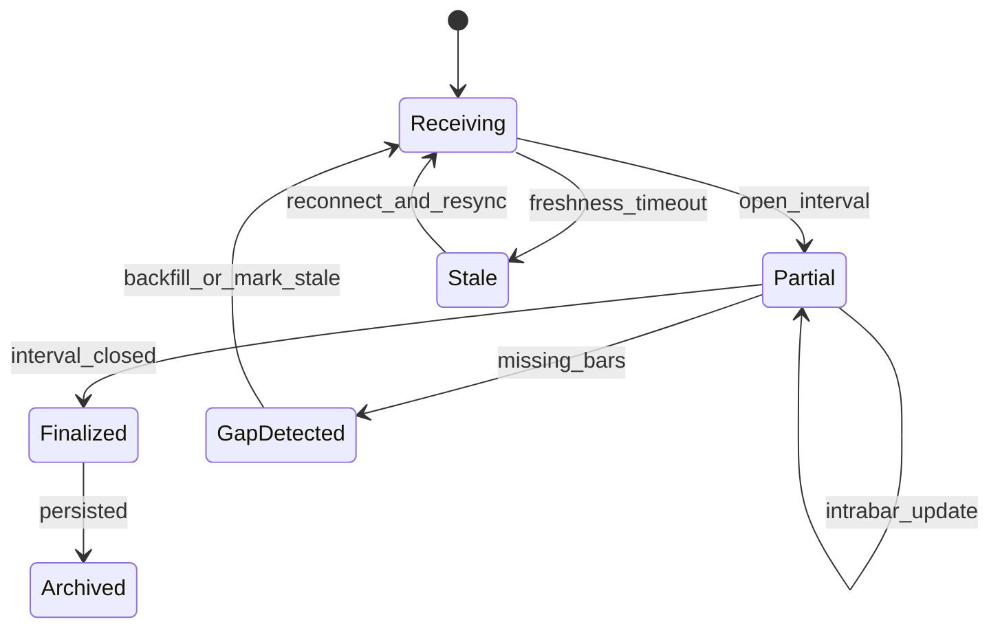
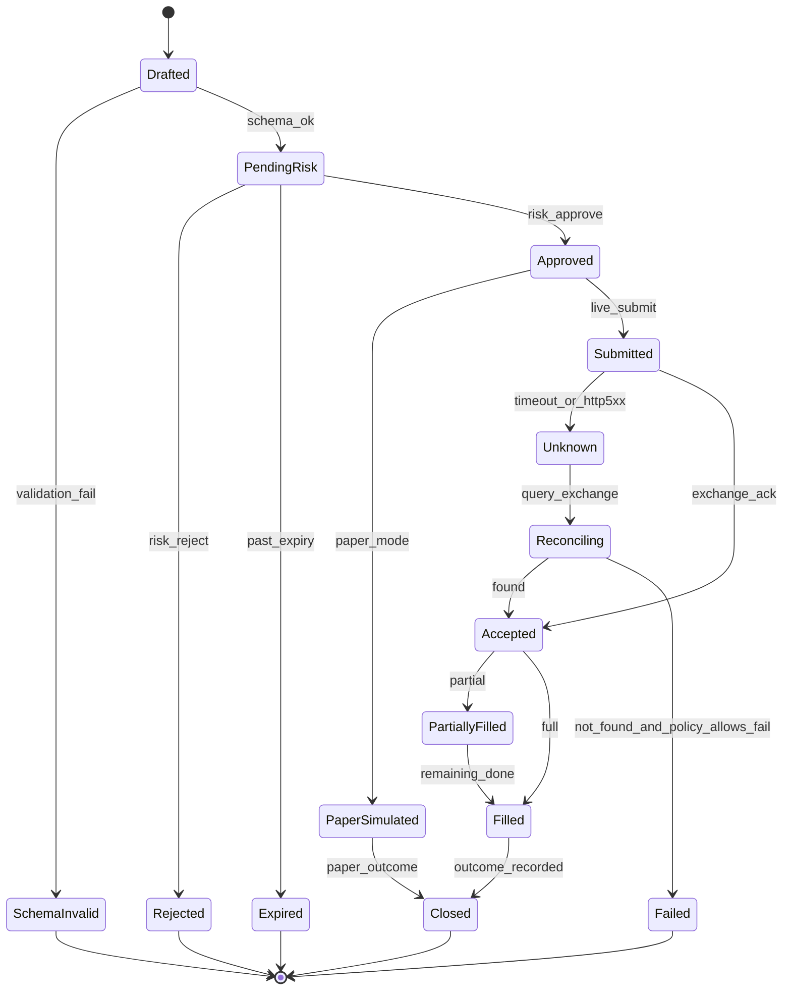
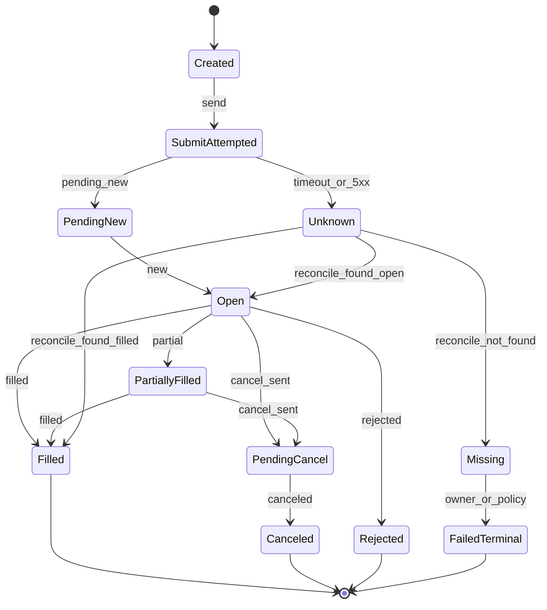
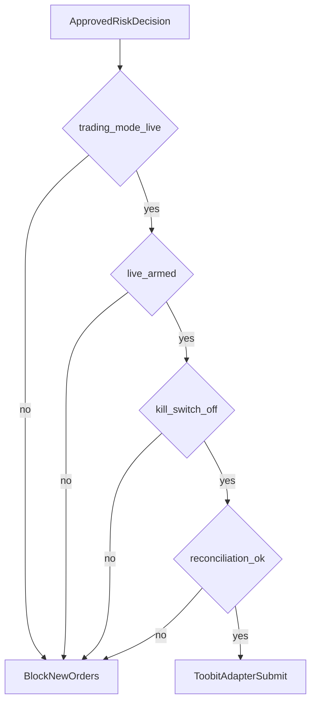

# Aegis — Architecture

**Version:** 1.0
**Status:** Proposed (Phase 0)
**Package:** `aegis`
**Related:** [PRD.md](PRD.md), [RFC.md](RFC.md), [THREAT_MODEL.md](THREAT_MODEL.md)

## 1. Classification legend

| Label | Use in this document |
| --- | --- |
| **Verified** | From official Toobit / TypeSafe docs (2026-10-09) |
| **Assumption** | Operational premise |
| **Proposed** | Design choice pending ADR acceptance |
| **Unresolved** | Needs owner or further documentation verification |

## 2. System context

Aegis is a personal trading system. External actors: project owner, Toobit exchange, TypeSafe Jev, optional LLM provider, optional configured news sources.

## 3. Component view

**Proposed:** modular monolith with the pipeline below. One Toobit adapter module exposes Spot and Futures ports.

### Component responsibilities

| Component | Responsibility | May hold exchange secrets |
| --- | --- | --- |
| Market Data | REST/WS ingest | No (public) / signed only if USER_STREAM requires key in adapter |
| Validation | Integrity, freshness, finalization | No |
| Feature Engine | Deterministic features | No |
| Analysts | Structured evidence | No |
| Evidence Builder | Versioned package | No |
| Jev Evaluator | System One call or mock | TypeSafe key only, never Toobit |
| LLM Supervisor | Schema proposal / NO_TRADE | Provider key only, never Toobit |
| Risk Engine | APPROVE / REJECT | No |
| Order Manager | Lifecycle, idempotency | No |
| Toobit Adapter | Sign and call Toobit | **Yes — only here** |
| Paper Broker | Simulated fills | No |
| Reconciliation | Compare local vs exchange | Reads via adapter |

## 4. Decision sequence

## 5. Candle lifecycle state machine

**Proposed** internal states (exchange stream may update open candles continuously).

Rules:

* Trading decisions that require finalized bars use only `Finalized` candles unless a strategy explicitly opts into intrabar (**Unresolved** which strategies may).
* `Stale` or `GapDetected` without successful resync blocks new Risk APPROVE for affected instruments.

## 6. Proposal lifecycle

## 7. Order state machine (local)

Map exchange statuses (**Verified** Toobit enums include `PENDING_NEW`, `NEW`, `PARTIALLY_FILLED`, `FILLED`, `PENDING_CANCEL`, `CANCELED`, `REJECTED`) onto local states:

**Critical rule:** From `Unknown`, never create a second submit for the same intent without reconciliation. Prefer `newClientOrderId` (**Verified** Spot optional; Futures v2 mandatory).

## 8. Live trading gates

## 9. Error handling principles

| Condition | Behavior |
| --- | --- |
| Stale market data | REJECT new trades; mark not ready |
| Jev timeout / 429 / 529 | Record unavailable; Supervisor may NO_TRADE; bounded retries only within evidence freshness window |
| LLM malformed output | Schema fail → NO_TRADE / drop; no execution |
| Risk REJECT | Stop; audit reason codes |
| Submit timeout / HTTP 5XX | **Verified** Toobit: execution status UNKNOWN → reconcile, no blind retry |
| Rate limit 429 | Back off until `X-Api-Limit-Reset-Timestamp` |
| Process restart | Reload open intents; reconcile before new orders |

## 10. Data stores

**Proposed:**

* PostgreSQL: instruments, candles, features, evidence, proposals, risk decisions, orders, fills, positions, paper ledger, audit, policy versions.
* Local filesystem or object storage for large backtest artifacts (optional later).
* No Redis in initial design.

## 11. Deployment topology

**Proposed:** Docker Compose on a single host: `aegis` app + PostgreSQL (+ optional Prometheus/Grafana). See [DEPLOYMENT.md](DEPLOYMENT.md).

## 12. Unresolved architecture questions

* Exact Futures private REST/WS paths for positions and balances (adapter interface until verified).
* Owner-approved emergency cancel/close automation.
* Whether Spot should migrate to API v2 once verified.
* LLM provider selection and budgets.
