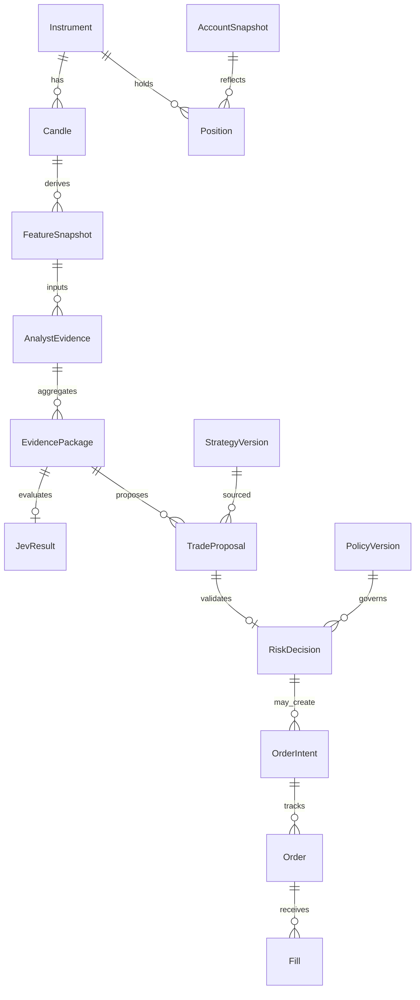

# Aegis — Data Model

**Version:** 1.0
**Status:** Proposed (Phase 0)
**Persistence:** PostgreSQL (**Proposed**)
**Package:** `aegis`

## 1. Design rules

* Paper and live ledgers are separate (distinct rows or `ledger_kind` discriminator).
* Every decision artifact carries `correlation_id` for end-to-end traces.
* Exchange is authoritative for live fills, positions, and balances after reconciliation.
* Do not store API secrets, signatures, or raw credential material.
* Prefer append-only audit events for mode changes and risk decisions.

## 2. Entity overview

## 3. Core entities

### 3.1 Instrument

| Field | Type | Notes |
| --- | --- | --- |
| id | UUID | Internal |
| exchange | string | `toobit` |
| market_type | enum | `spot`, `futures` |
| symbol | string | Exchange id, e.g. `ETHUSDT` or `BTC-SWAP-USDT` |
| base_asset | string | |
| quote_asset | string | |
| status | string | From exchange metadata when available |
| precision / filters | JSON | tick, step, min notional, etc. |
| contract_multiplier | decimal nullable | Futures; semantics **Unresolved** vs order qty |
| updated_at | timestamptz | |

### 3.2 Candle

| Field | Type | Notes |
| --- | --- | --- |
| instrument_id | UUID | |
| interval | enum | `1m`, `5m`, `15m` |
| open_time | timestamptz | Exchange open |
| close_time | timestamptz | |
| ohlcv fields | decimal | |
| is_final | bool | |
| source | string | rest/ws |
| received_at | timestamptz | Local |

Unique: `(instrument_id, interval, open_time)`.

### 3.3 FeatureSnapshot

Deterministic feature vector for an instrument/timeframe/as-of time, with feature schema version.

### 3.4 AnalystEvidence

| Field | Type | Notes |
| --- | --- | --- |
| analyst_type | enum | technical, quantitative, news_sentiment, analytical_risk, strategy_researcher |
| status | enum | `ok`, `unavailable`, `not_applicable`, `error` |
| payload | JSON | Schema-validated |
| evidence_time | timestamptz | |
| sources | JSON | Provenance |

### 3.5 EvidencePackage

Versioned bundle linking feature + analyst evidence ids, created_at, schema_version, correlation_id.

### 3.6 JevResult

| Field | Type | Notes |
| --- | --- | --- |
| evidence_package_id | UUID | |
| model | string | Versioned id from response when available |
| status | enum | `ok`, `unavailable`, `error` |
| answers | JSON | Normalized noul/choice/score |
| usage | JSON | Token usage |
| latency_ms | int | |
| confidence_notes | text | Explicitly not profit probability |

### 3.7 TradeProposal

See [API_CONTRACTS.md](API_CONTRACTS.md). Persist full validated proposal including action `BUY|SELL|HOLD|NO_TRADE`, strategy version, expiry, invalidation conditions, supervisor metadata.

### 3.8 RiskDecision

See [RISK_POLICY.md](RISK_POLICY.md) §4. Links `proposal_id`, `policy_version`, APPROVE/REJECT.

### 3.9 OrderIntent / Order / Fill

| Entity | Purpose |
| --- | --- |
| OrderIntent | Internal intent after APPROVE; carries client_order_id, ledger_kind |
| Order | Exchange or paper order state machine |
| Fill | Partial or full execution records |

`ledger_kind`: `paper` | `live`.

### 3.10 Position / AccountSnapshot

Separate rows per ledger. Live positions reconciled from exchange. Paper positions from paper broker only.

### 3.11 PolicyVersion / StrategyVersion

Immutable version records with content hash, created_by, approved_at (nullable until owner approval), status.

### 3.12 AuditEvent

Append-only: event_type, actor (`system`|`owner`), correlation_id, payload (redacted), created_at.

### 3.13 BacktestRun / Experiment

Strategy version, dataset version, train/val/oos splits, assumptions JSON, metrics JSON, software version.

## 4. Retention (**Unresolved**)

Owner must set retention for market data, prompts, and audit logs. Until set, retain indefinitely on the single host is an **Assumption** with disk-risk noted in [OPERATIONS.md](OPERATIONS.md).

## 5. Migration stance (**Proposed**)

Use a migration tool (e.g. Alembic) from Phase 1. Schema changes require migrations; no silent auto-alter in production.
