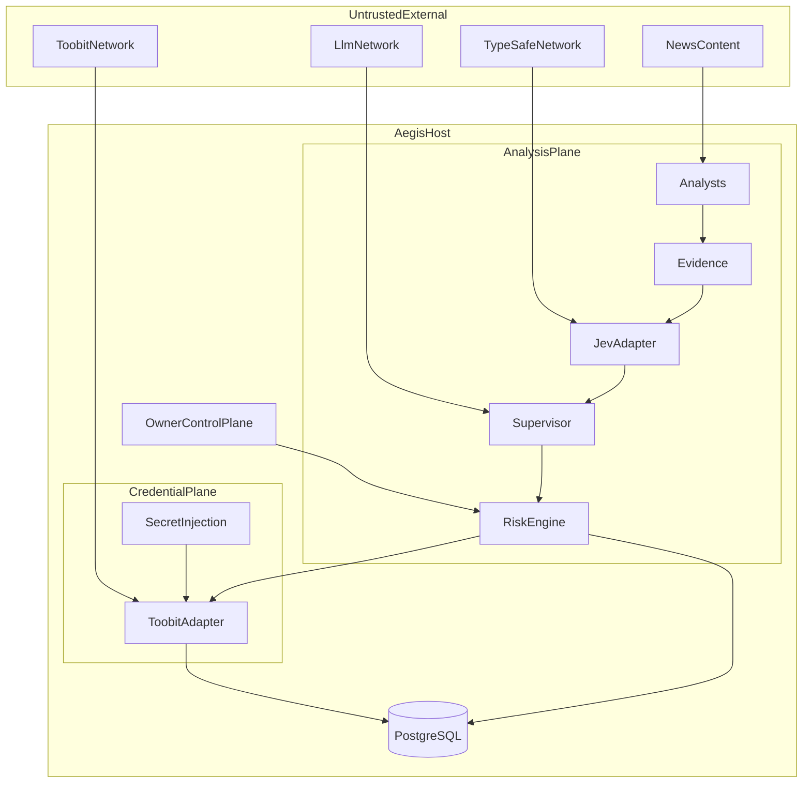

# Aegis — Threat Model

**Version:** 1.0
**Status:** Proposed (Phase 0)
**Method:** Trust-boundary focused STRIDE-style analysis for a personal trading system
**Related:** [ARCHITECTURE.md](ARCHITECTURE.md), [RISK_POLICY.md](RISK_POLICY.md), [PRD.md](PRD.md)

## 1. Assets

| Asset | Sensitivity |
| --- | --- |
| Toobit API key and secret | Critical |
| TypeSafe / LLM API keys | High |
| Account balances, positions, order history | High |
| Risk policy and live-arm configuration | Critical |
| Evidence packages and prompts (may contain market strategy detail) | Medium |
| Audit logs | High (integrity) |
| Owner host access | Critical |

## 2. Trust boundaries

| Boundary | Rule |
| --- | --- |
| Analysis plane ↔ Credential plane | No Toobit secrets cross into analysts, Jev, or Supervisor |
| Owner control ↔ Models | Models cannot write live mode, arm flag, kill switch, or risk policy |
| News / retrieved text ↔ Supervisor | Treat as untrusted data; ignore embedded instructions |
| Exchange responses ↔ Local ledger | Exchange is authoritative for fills/positions/balances after reconcile |

## 3. Threat catalog

| ID | Threat | Category | Mitigation | Residual risk |
| --- | --- | --- | --- | --- |
| T-01 | LLM or Jev obtains exchange credentials and places orders | Elevation / Spoofing | Secrets only in Toobit adapter; no execution tools on models | Misconfiguration of env injection |
| T-02 | Model output overrides risk limits | Tampering | Risk Engine ignores natural language; typed policy only | Bug in policy loader |
| T-03 | Prompt injection via news or documents | Tampering | Untrusted content labeling; schema-only supervisor output; prefer NO_TRADE | Novel injection patterns |
| T-04 | Secret leakage in logs or prompts | Information disclosure | Redaction filters; forbid signing material in log fields | Incomplete redaction |
| T-05 | Withdrawal via API key | Elevation | Never call `POST /api/v1/account/withdraw`; request least privilege (**Unresolved** whether withdraw can be disabled independently) | Exchange permission model ambiguity |
| T-06 | Duplicate orders after timeout | Tampering / Denial | Client order IDs; reconcile on unknown; no blind retry (**Verified** Toobit 5XX = unknown) | Exchange ID collision / lost query |
| T-07 | Stale data trades | Tampering | Freshness gates in Risk Engine | Clock skew |
| T-08 | Live mode enabled accidentally | Elevation | Triple gate: mode + arm + kill switch; startup guard; default paper | Operator error |
| T-09 | Supply-chain / dependency compromise | Tampering | Pin deps; image scan before deploy | Zero-days |
| T-10 | Rate-limit lockout / IP ban | Denial | Respect 429 headers; backoff; prefer WebSocket market data | Aggressive misconfig |
| T-11 | Compromised host reads secrets | Information disclosure | File perms; optional secret manager; IP allowlist on exchange key | Full host compromise |
| T-12 | Agent Trade Kit / MCP order tools used beside Aegis | Elevation | Explicitly out of scope; do not deploy alongside Aegis credentials | Operator installs separately |

## 4. Security requirements (derived)

1. Deny-by-default live trading.
2. Least-privilege Toobit key; IP restriction where supported (**Verified** docs recommend IP restrictions).
3. Validate all external and model payloads with Pydantic.
4. Audit every risk decision, mode change, and order state transition.
5. Separate paper and live ledgers.
6. Bound model cost and concurrency.

## 5. Assumptions

* Owner is the only human operator with host and exchange account access.
* Official HTTPS endpoints for Toobit and TypeSafe are used (no unofficial mirrors).

## 6. Unresolved

* Exact Toobit API-key permission matrix for “trade without withdraw.”
* Whether emergency auto-cancel/close is desired (security vs capital protection tradeoff).
* Backup encryption and off-host retention policy.
